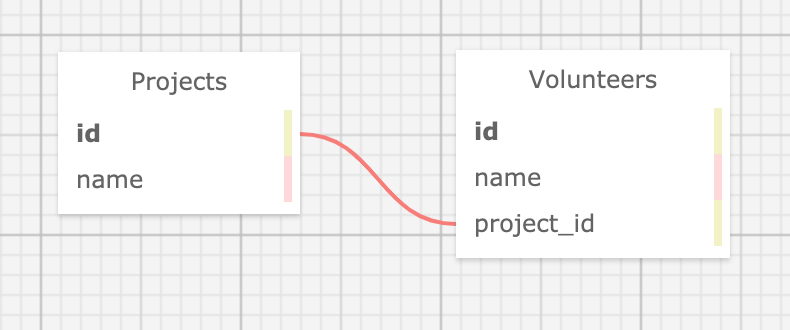

# _Volunteer Tracker_

_9 October 2020_

#### _Application for tracking projects and associated volunteers_

#### By _**Vanessa Stewart**_

## Description

_This is a project for Epicodus to demonstrate mastery using basic SQL database methods with a Sinatra application. The application is for a fake non-profit in need of tracking projects and the volunteers working on each project. The original directions for the assignment include:_

Create an application that tracks projects and the volunteers working on them. Each volunteer will belong to only one project (one project, many volunteers).The following user stories should be completed:

* As a non-profit employee, I want to view, add, update and delete projects.
* As a non-profit employee, I want to view and add volunteers.
* As a non-profit employee, I want to add volunteers to a project.

Objectives
Your code will be reviewed for the following objectives:
* Tests are 100% passing. You may not significantly alter the included tests but you may add additional tests as necessary.
* Database is set up correctly.
* Correct set up of a one-to-many relationship.
* Sinatra has required CRUD functionality.
* Project has strong commit history.
* Project has detailed README with all necessary setup instructions and a description of the project.
* Required functionality was in place by the Friday deadline.
* Student can demonstrate understanding of Ruby concepts if asked.

Further Exploration
* Add full CRUD functionality for volunteers.
* Add a search function so employees can find projects and volunteers by name.
* Add a sort function so projects and volunteers can be sorted alphabetically.
* Add an hours field to the volunteers table to track how many hours each volunteer has worked. Employees should be able to sort volunteers by most and least hours.
* Add a method that calculates how many total hours all volunteers have put into a single project.
* Make projects sortable by total hours as well.

## Specifications
| Spec     | Behavior | Code Translation | 
| -------- | -------- | -------- |
| 1 | User(fake non-profit employee) can view, add, update, and delete projects. | Create a project class with methods for CRUD functionality. | 
| 2 | User(fake non-profit employee) can view and add volunteers. | Create a volunteer class with methods for CRUD functionality.  |  
| 3 | User(fake non-profit employee) can add volunteers to a project. | Volunteer class needs update method for adding project_id property. |  

## Stretch Specifications
| Spec     | Behavior | 
| -------- | -------- |
| 4 | Add full CRUD functionality for volunteers. |  
| 5 | Add a search function, so employees can find projects and volunteers by name. | 
| 6 | Add a sort function so projects and volunteers can be sorted alphabetically. |
| 8 | Add an hours field to the volunteers table to track how many hours each volunteer has worked. Employees should be able to sort volunteers by most and least hours. |  
| 9 | Add a method that calculates how many total hours all volunteers have put into a single project. |    
| 10 | Make projects sortable by total hours as well. |   

## Visualization of Data Tables


## Setup/Installation Requirements

To View Project:
* Open a web browser of your choice and navigate to the following page:

To Extend This Project:
- Navigate to the directory on your local computer where you would like to clone this repo.
- Clone this repo using the `git clone` command in terminal/command line.
- Navigate to the cloned folder and run `gem install bundler` to install Bundler, which will mange all gem installations for our project.
- Run `bundle` or `bundle install` in your command line to download all dependencies. (If add additional gems later, you will need to run `bundle update <gem name>`.)
- Open the cloned repo in a text editor of your choice.
- You will need Postgres for this project. Find directions [here](https://www.learnhowtoprogram.com/ruby-and-rails/getting-started-with-ruby/installing-postgres) for installing Postgres.
- Once Postgres is installed, access the Postgres server by opening a terminal and run `postgres`.
- In another terminal, run `psql`, which is how you will interact with your Postgres databases.
- Create databases and tables with the following commands:
```
USER=# CREATE DATABASE volunteer_tracker;
USER=# \c volunteer_tracker;
USER=# CREATE TABLE projects (id serial PRIMARY KEY, name varchar);
record_store=# CREATE TABLE volunteers (id serial PRIMARY KEY, name varchar, project_id int);
record_store=# CREATE DATABASE volunteer_tracker_test WITH TEMPLATE volunteer_tracker;
```
- To Run Tests: While in the root directory of this project, run `rspec` in your command line.
- To Run the App in Browser: While in the root directory of the project, run `ruby app.rb` in the terminal. This will start a server, which you can access by entering `localhost:4567` in your browser.
- Have fun and be a good person!

## Known Bugs

_There are no known bugs at this time._

## Support and Contact Details

_Connect with me at vamariestewart@gmail.com with ideas to improve this project._

## Technologies Used

* HTML5/Embedded Ruby(.erb)
* CSS/Bootstrap
* Ruby
* Ruby Gems: Capybara, Pry, PG, RSpec, Sinatra, Sintara-Contrib
* Postgres/psql

### License

Copyright (c) 2020 **_Vanessa Stewart_**

Permission is hereby granted, free of charge, to any person obtaining a copy of this software and associated documentation files (the "Software"), to deal in the Software without restriction, including without limitation the rights to use, copy, modify, merge, publish, distribute, sublicense, and/or sell copies of the Software, and to permit persons to whom the Software is furnished to do so, subject to the following conditions:

The above copyright notice and this permission notice shall be included in all copies or substantial portions of the Software.

THE SOFTWARE IS PROVIDED "AS IS", WITHOUT WARRANTY OF ANY KIND, EXPRESS OR IMPLIED, INCLUDING BUT NOT LIMITED TO THE WARRANTIES OF MERCHANTABILITY, FITNESS FOR A PARTICULAR PURPOSE AND NONINFRINGEMENT. IN NO EVENT SHALL THE AUTHORS OR COPYRIGHT HOLDERS BE LIABLE FOR ANY CLAIM, DAMAGES OR OTHER LIABILITY, WHETHER IN AN ACTION OF CONTRACT, TORT OR OTHERWISE, ARISING FROM, OUT OF OR IN CONNECTION WITH THE SOFTWARE OR THE USE OR OTHER DEALINGS IN THE SOFTWARE.